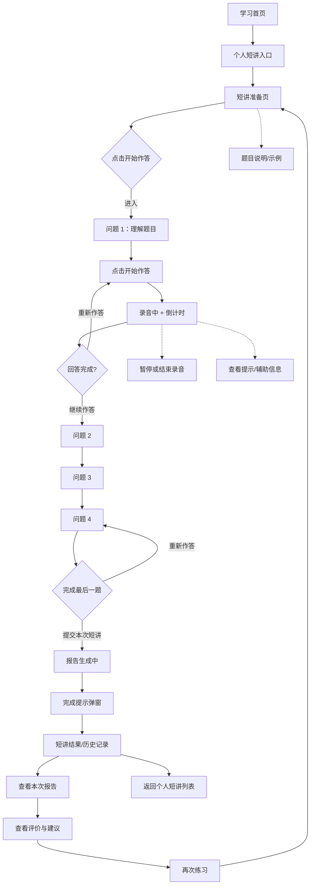
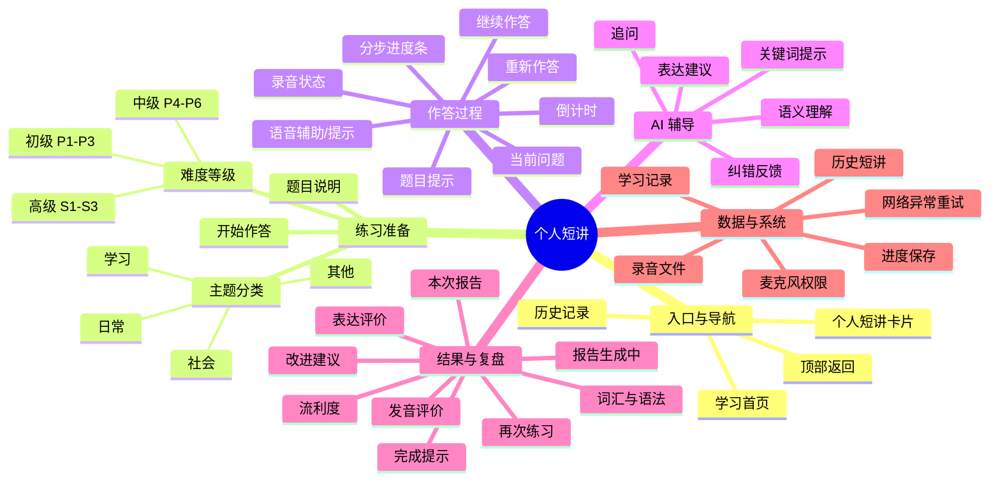

# 个人短讲｜功能分析

> 来源：`Desktop/中文路/APP 页面/个人短讲/` 页面截图。以下流程按截图中的页面状态和交互推断，具体接口、评分规则和权限仍需产品确认。

## 一、功能定位

个人短讲是一套面向中文口语表达训练的结构化练习功能。用户选择难度/主题后，围绕一组问题进行限时语音回答，系统在结束后生成本次短讲报告，并沉淀历史记录。

核心价值：

- 通过固定问题降低开口门槛；
- 通过倒计时和录音形成完整口语练习闭环；
- 通过 AI 追问、提示和报告帮助用户复盘；
- 通过等级、分类和历史记录形成持续学习路径。

## 二、APP 流程图



## 三、功能思维导图



## 四、页面与状态清单

| 页面/状态 | 主要功能 | 关键操作 |
|---|---|---|
| 个人短讲入口 | 展示功能说明和进入按钮 | 开始短讲、返回 |
| 准备页 | 展示当前主题、题目说明和开始状态 | 开始作答 |
| 问题页 | 展示问题、分步进度和辅助说明 | 开始录音、下一题 |
| 录音中 | 录制语音并倒计时 | 继续、重新作答、结束 |
| 报告生成中 | 告知系统正在处理本次录音 | 我知道了 |
| 完成提示 | 告知报告已生成 | 查看报告、稍后查看 |
| 历史记录 | 按主题查看过往短讲 | 打开某次记录 |
| 题库页 | 按等级和分类浏览题目 | 选择等级、主题、题目 |
| 课程页 | 展示初级/中级/高级训练入口 | 进入对应训练 |

## 五、建议的业务状态

```text
未开始 → 准备中 → 作答中 → 已完成当前题 → 下一题
                         ├→ 重新作答
                         └→ 中断/异常恢复
最后一题完成 → 提交 → 报告生成中 → 报告已生成 → 已查看/未查看
```

## 六、需要进一步确认的产品规则

1. 每道题的默认作答时长、是否允许提前结束，以及是否允许无限次重录。
2. “AI 追问”是实时语音追问，还是完成回答后的文本/语音反馈。
3. 报告的评分维度、分数规则和是否需要展示原始录音。
4. 报告生成失败、网络断开、麦克风拒绝时的恢复策略。
5. 个人短讲是否需要登录、是否支持儿童/家长多账号和跨设备同步。
