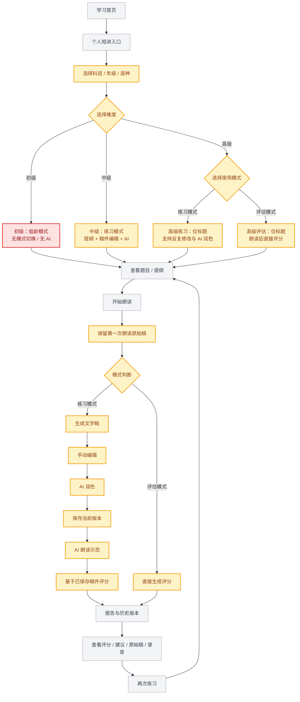

# 个人短讲迭代需求｜标注版

## 标注图例

- <span style="color:#F59E0B">橙色：本次新增或需要修改</span>
- 灰色：现有能力，保留不变
- <span style="color:#DC2626">红色：暂不支持、风险或待确认</span>

## 一、迭代后的核心定位

个人短讲从“固定五步的单次练习”升级为“按难度配置、区分练习/评估、支持稿件版本管理和 AI 辅导的口语训练系统”。

## 二、标注版流程图



## 三、标注版功能思维导图

```mermaid
mindmap
  root((个人短讲 v2))
    入口与基础配置
      学习首页
      个人短讲入口
      [新增] 默认科目记忆
      [新增] 年级配置
      [新增] 普通话/粤语选择
        [风险] 粤语暂无语音评测
    难度配置
      [新增] 初级
        低龄用户
        无模式切换
        无 AI
      [修改] 中级
        仅练习模式
        提纲
        稿件编辑
        AI 润色
        朗读与评分
      [新增] 高级
        仅标题
        练习模式
        评估模式
    作答与稿件
      题目/提纲
      朗读录音
      [新增] 原始稿永久保留
      [新增] 文字稿版本
      [新增] 手动编辑
      [新增] AI 润色
      [新增] AI 朗读示范
    评分与复盘
      [修改] 练习模式基于润色稿评分
      [修改] 评估模式朗读后直接评分
      [新增] 多次练习历史
      [新增] 默认展示最近评分
      [新增] 查看历史版本
      发音/表达/流利度
      改进建议
    流程配置
      [修改] 五步改为可配置步骤
      老师配置
      运营配置
      增删步骤
      场景化模板
    语言规则
      [修改] 三声变调标注
      变调提示
      不变调显示原调
      [待确认] 一/不变调
```

## 四、页面改造清单

| 页面 | 页面需要怎么改 | 标注 |
|---|---|---|
| 个人短讲入口 | 增加难度入口、最近稿件、最近一次评分和继续练习 | 橙色 |
| 练习准备页 | 增加科目、年级、语种、难度和模式选择；粤语显示“暂不支持语音评测” | 橙色 + 红色提示 |
| 初级练习页 | 保持低龄、简单操作，不出现 AI、模式切换和复杂编辑 | 灰色保留 |
| 中级练习页 | 增加提纲、文字稿编辑、AI 润色、保存、AI 朗读示范 | 橙色 |
| 高级练习页 | 去掉提纲，仅保留标题；增加练习/评估模式切换 | 橙色 |
| 朗读页 | 增加“原始稿已保存”状态，明确展示录音、计时和重新朗读 | 橙色 |
| 稿件编辑页 | 支持原始稿、当前稿、AI 润色稿版本切换和保存 | 橙色 |
| 评估结果页 | 评估模式直接出分；练习模式标明“基于润色稿评分” | 橙色 |
| 个人稿件库 | 新增全部稿件、版本、评分、录音和最近一次结果 | 橙色 |
| AI 朗读示范 | 在稿件保存或 AI 润色完成后提供入口 | 橙色 |
| 三声变调 | 单字显示实际读音和提示，不变调场景显示原调 | 橙色 |
| 流程配置后台 | 将固定五步改为可增删的流程模板 | 橙色 |

## 五、页面视觉标注建议

在原型评审稿中统一使用以下颜色：

```text
灰色：原有页面和原有流程
橙色 #F59E0B：本次需求新增或修改的控件、字段、状态
红色 #DC2626：暂不支持、需要产品确认或可能造成误解的提示
绿色 #16A34A：已完成并通过验证的功能
```

具体页面上可以给新增区域加“本次迭代”标签，例如：

- `模式选择 · 本次迭代`
- `AI 朗读示范 · 本次迭代`
- `原始稿 / 润色稿版本 · 本次迭代`
- `粤语暂不支持语音评测 · 重要提示`

## 六、建议开发顺序

1. 难度配置与练习/评估模式分流。
2. 原始稿、润色稿和历史评分的数据结构。
3. 中级练习流程：文字稿、AI 润色、保存、评分。
4. 高级评估流程：朗读后直接评分。
5. 个人稿件库和历史版本查看。
6. 年级、科目、语种配置及默认科目记忆。
7. AI 朗读示范、三声变调和可配置步骤。
